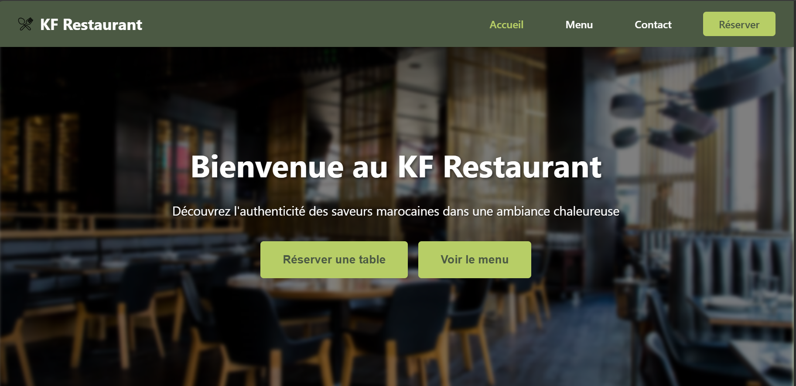
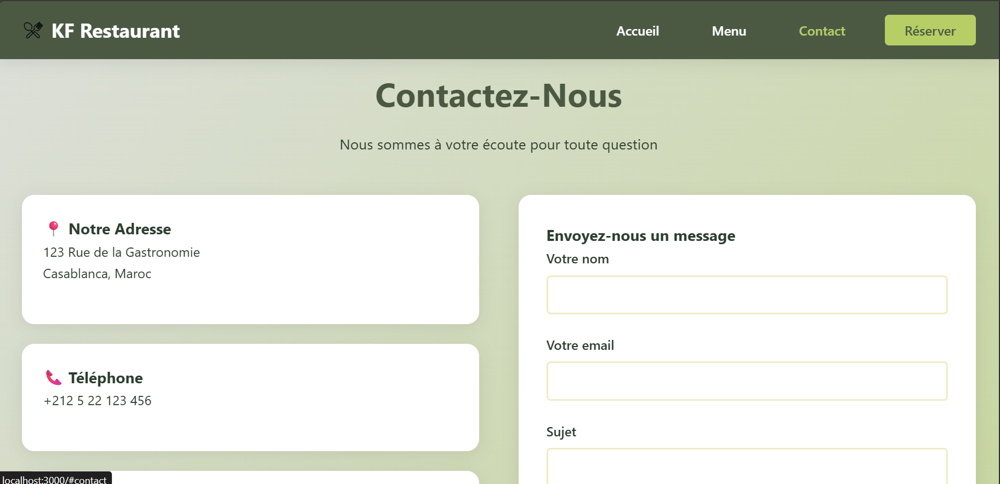
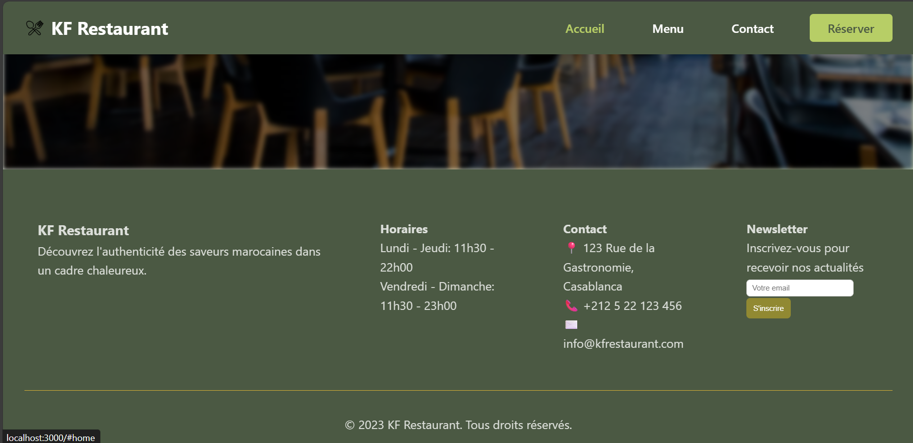
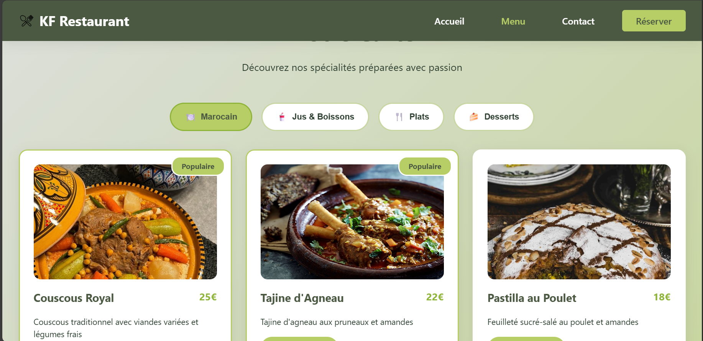
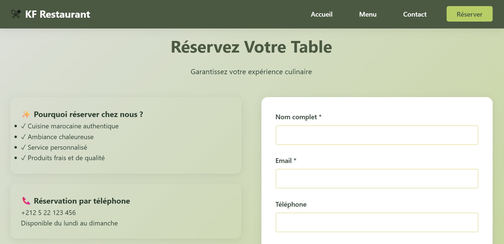

#  Restaurant Reservation App
 KF Restaurant
##  Table des Matières

* [Introduction](#introduction)
* [Prérequis](#prérequis)
* [Structure du projet](#structure-du-projet)
* [Fonctionnalités](#fonctionnalités)
* [creation](#creation)
* [Usage](#usage)
* [Auteurs](#auteurs)

---

##  Introduction

Ce projet est une application web de **gestion de réservations pour un restaurant**, développée avec **React, HTML et CSS**.

Elle permet aux utilisateurs :

* de consulter les tables disponibles,
* d'effectuer une réservation,
* de visualiser leurs réservations,
* et éventuellement d'annuler une réservation.

L'objectif est d'offrir une **interface simple, intuitive et responsive** pour gérer les réservations.

---

## Prérequis

Avant de lancer le projet, assurez-vous d'avoir installé :

* **Node.js** (v16 ou supérieure)
* **npm** 
* Un navigateur moderne (Chrome, Firefox, Edge)

---

##  Structure du projet

```
reservation/
├── public/
│   ├── index.html
│   └── ...
├── src/
│   ├── images/
│   ├── components/
│   │   ├── Contact.js
│   │   ├── Footer.js
        ├── Loading.js
        ├── Menu.js
        ├── Navbar.js
        ├── Reservation.js
│   │   └── Home.js
│   ├── App.js
│   ├── index.js
│   └── styles/
│       ├── App.css
│       └── ...
├── package.json
└── README.md
```

---

##  Fonctionnalités

* Afficher la liste des **tables disponibles**
* **Réserver** une table
* Consulter ses **réservations**
* **Annuler** une réservation 
* Interface **responsive** (HTML/CSS)

---

##  creation
mkdir

###  Installer les dépendances

```
cd reservation
npm install
```

###  Lancer le projet

```
npm start
```

L'application sera accessible sur :
 [http://localhost:3000](http://localhost:3000)

---

##  Usage

1. Ouvrez l'application dans votre navigateur.
2. Consultez les tables disponibles.
3. Remplissez le formulaire de réservation :

   * Nom
   * Email
   * Date et heure
   * Nombre de personnes
4. Cliquez sur **"Réserver"**.
5. Visualisez la réservation dans la liste.


---

##  Auteurs

* **Khadija Fatihi** – Développement front-end React

---

##  Captures d'écran

Ajoutez vos images dans un dossier `images/` puis affichez-les ici :







```
---
